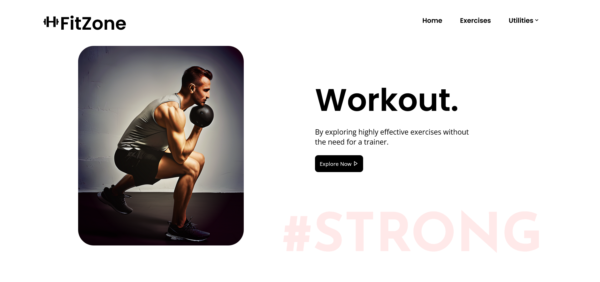
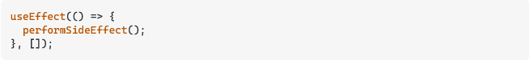
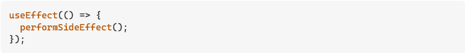

# FitZone-Your fitness Partner

## Overview:
Fitzone offers an extensive array of exercises, each accompanied by informative GIF videos illustrating proper execution techniques. Furthermore, the website recommends pertinent YouTube videos to further enrich your understanding of these exercises. Beyond this, the site recommends alternative exercises that target similar muscles, body parts, and equipment. It also features a BMI calculator, allowing you to assess your body mass index and gain valuable insights into your health status. Additionally, you can determine your daily calorie requirements, equipping you with the knowledge to tailor your nutrition plan effectively. And to support your fitness goals even further, the site provides insight into the ideal weight range for your height, empowering you with essential benchmarks for your journey towards a healthier lifestyle. You can also add specific exercises to favourties to access them later.

## Motivation:
The inspiration behind creating such a website came from the need for a comprehensive one-stop platform that simplifies the understanding of all fancy named gym exercises like the "Assisted Parallel Close Grip Pull Up".This is extremely helpful to beginners seeking guidance without a trainer or anyone who wants to know about an exercise.

My personal experience at our college made me realise this problem. There was a instance where the gym trainer was not around, and there were exercise which I did not know, in the white board where they write a list of exercises based on the day's theme. I had to repeatedly search them online and everytime I searched a new exercise, I had to search a new webiste as it wasnt there in the previous one. This inconvenience gave me an idea of a user friendly website which solves this problem.

## Implementation:
Frontend is built using React and CSS. Backend is a REST based API built using node, express, and MongoDB atlas. Overall I used the entire MERN Stack even though I didnt know anything when I started the project.  
I had very little to no knowledge about web-devolpment and how websites worked. I started by learning HTML and CSS from [FreeCodeCamp.org](https://www.youtube.com/c/Freecodecamp). I then learnt JavaScript and built a very basic static website using HTML, CSS and JS while following along with tutorials by [CodeWithHarry](https://www.youtube.com/@CodeWithHarry). I then learnt React, how to use react hooks, React router, and finsihed the basic UI structure of the site. The react documentation is very well written. I then watched [Traversy media](https://www.youtube.com/channel/UC29ju8bIPH5as8OGnQzwJyA) on how to use APIs and use fetchAPI call from JS, await, async and integrated them. I also used some React libraries like 'react-top-loading-bar', 'react-type-animation'. I then came to know about responsive websites and made my website mobile friendly. I have styled everything including animations(except the typing animation, which I tried and realized theres a react library for it) in plain CSS, without using any framework. I then felt the need for a backend so that users can add specific exercises to favourites and access them later. I learned node and building apis using express from [Traversy media](https://www.youtube.com/channel/UC29ju8bIPH5as8OGnQzwJyA). I used MongoDB atlas to store user info and favourites. I learnt about Json web token to store login state and implemented that.

## Technologies/libraries used
* React
* MongoDB
* Express
* NodeJS
* mongooose
* JSON web token
* Rapid API
* react-type-animation
* react-toastify
* react-router-dom
* react-top-loading-bar

## Experience:
I enjoyed building this site very much as this was my first completely self built website from scratch. At times I got frustrated due to the problems I ran into, mainly the free API usage limit, I had to create 5 extra google accounts to avail free API usage, but overall it was a great experience. This project has increased my interest in WebDev and devolopment in general. I further plan to learn bootstrap as it makes styling and responsiveness very easy. I am also learning automation with selenium. I also want to explore GameDev and DevOps. 

## Problems faced and how I solved them:
As I was new to React/Node, I ran into numerous problems from wrong syntax to react router not scrolling the page to top, most of which were solved with the help of StackOverFlow and some other sites. Some of them are listed below.

1. I wanted useEffect to fire every time the page is reloaded, that is act like componentDidMount, I realized that an empty dependency array does this. So I left the dependency blank (not empty array) as shown below. The first picture is how it should be done, the second picture is what I did.

 

But this acted like both componentDidMount and componentDidUpdate and kept on firing useEffect and I had to empty my free usage limit of RapidApi from 2 accounts before realizing the difference and solving it. I found the solution for this on StackOverflow.

2. The setState function is asynchronous, so when initially I render the state after fetching from api, it is the state hook initialised value that Iam rendering. I had initialised my state not specific to the api response format, so when it was supposed to render for the first time it gave error as I had some functions which process the state(like toUppercase) before rendering for which the parameters werent there in the initialized state. Hence I learnt about optional chaining which basically checks if something is not null before applying methods on it. It is just condensed form of if else but it makes code look way neater as it condenses very much. 

3. Another major problem I ran into was because of bad naming, I named multiple different divs as class container even though they had differnt properties. When I changed css proprerty for one container other container's css property also changed, I was confused at first then later realized the issue. It was a difficult job to change classes of so many components again. I then came to know about sass which is a prepeocessor and makes writing css very easy but I had already written most of my styling in css so didnt think of changing it, but I will be using sass in my future projects.

4. CORS was the one causing major problems. When it first gave CORS error I thought I made an error in feth request, So I spent a lot of time checking it out. After spending too much time on it , I googled it to find that its common and easy to fix :/. I am allowing all the origins to access Backend data, ie set the allow-access-origin to "*" using the cors npm package.

5. When I attempted to host backend on render and frontend on netlify, everything worked fine except that out of the 6 API endpoints, 3 of them gave cors error "allow-access-origin not specified" even after specifying "*" for allow-access-origin. I did not find the reason nor solution for this problem, hence I had to drop the idea of hosting the website.  

6. I made a major mistake in css units. With the plan of making fluid website in the name of responsiveness, I have given font sizes in vw/vh which I realized is a mistake as it disables browser zoom. As I discovered the bug a little late, I plan to correct it after the evaluation.

## Future scope

* As I ran into problems while hosting the website, I should host it and also make it optimized for search engines (Search engine optimiziation SEO) .
* I plan to make dedicated workout routine for every muscle/bodyPart which enables users to choose their workout routine based on time available and target muscle which will track their workout over time and suggest harder exercises.
* I also plan to gamify it by adding points per exercise completed, which will be measured based on time spent on a particular exercise, daily challenges, competition, leaderboards etc.
* I also want to figure out a way to make the website available offine, where users can download exercises.

